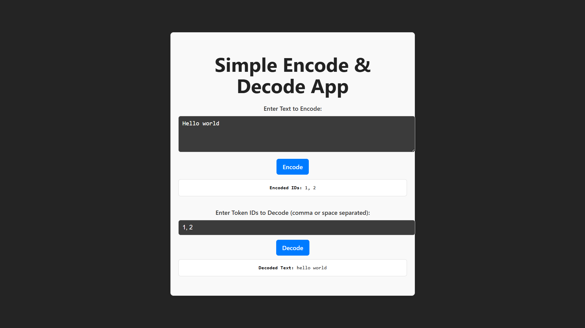

📜 Custom Tokenizer App
The Custom Tokenizer App is a React-based application that lets you create your own tokenizer, learn vocabulary from any text, and easily encode and decode text.
It’s designed to be simple, interactive, and visually appealing, while also showcasing the core concepts of tokenization in Natural Language Processing (NLP).

✨ Features
Learn Vocabulary: Automatically build a vocabulary from input text.

Encode: Convert text into a sequence of token IDs.

Decode: Convert token IDs back into human-readable text.

Special Tokens Support: Handle tokens like <PAD>, <UNK>, etc.

Clean UI: Minimal, responsive design for easy use.

🛠️ Built With
React.js – UI framework

JavaScript – Core logic for tokenization

CSS / Tailwind CSS – Styling
